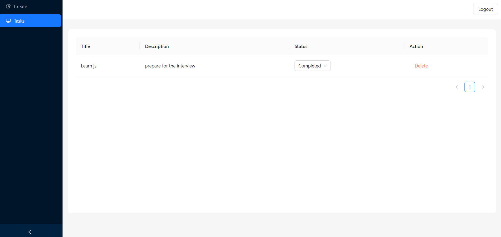

# Task Manager

This project is a Task Manager application built using Express, PostgreSQL, Firebase Authentication, and React with Ant Design. It provides functionality to create, view, update, and delete tasks associated with authenticated users.

## Live link

[Click here]()
note - initial loading takes time as it takes 50 - 60 seconds to start the server.

## Table of Contents

- [Installation](#installation)
- [Usage](#usage)
- [API Endpoints](#api-endpoints)
- [Technologies Used](#technologies-used)


## Installation

1. Clone the repository:

```bash
   git clone https://github.com/sac1010/icliniq.git
   cd icliniq
```
2. Install server dependencies:
```bash
   cd server
   npm install
```
3. Install client dependencies:
```bash
   cd ../client
   npm install
```


## Usage

1. Start the server
```bash
cd server
npm run dev
```
The client will start on http://localhost:3000.

2. Start the client
```bash
cd client
npm start
```
The client will start on http://localhost:3001. 

## API Endpoints
Base URL: http://localhost:3001/

- POST /tasks - Create a new task
- GET /tasks - Get all tasks for the authenticated user
- GET /tasks/:id - Get a task by ID
- PUT /tasks/:id - Update a task by ID
- DELETE /tasks/:id - Delete a task by ID

## Technologies Used

1. Backend:

- Node.js
- Express
- PostgreSQL
- sequelize

2. Frontend:

- React
- Ant design
- Tailwind css

# Screenshots
